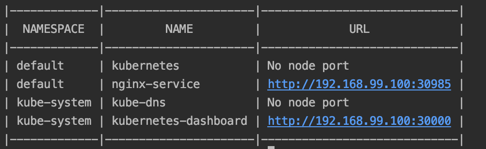
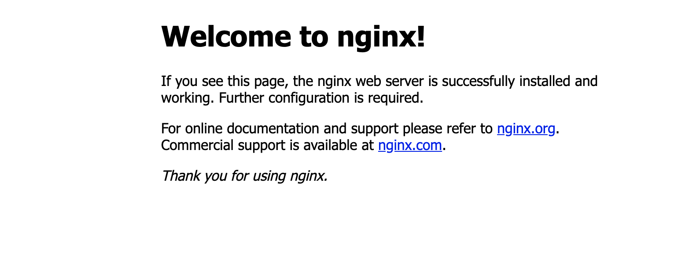

# Deploy simple Nginx service in Minikube

#### This Kubernetes cluster was configured in Minikube. See this [tutorial](https://v1-18.docs.kubernetes.io/docs/tasks/tools/install-minikube/) to install it.

## Nginx service configuration.

Use the `nginx-deployment.yaml` file, we are going to set the deployment:
``` 
kubectl apply -f nginx-deployment.yaml
```

Then with `nginx-svc.yaml` we can bring up the service: 
``` 
kubectl apply -f nginx-svc.yaml
```

To see the service, you can run:
``` 
minikube service list
```



Where you will able to see the URL where you can access the Nginx server:



